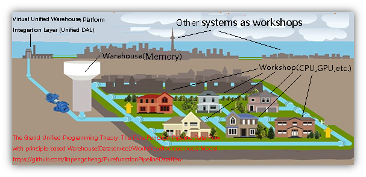
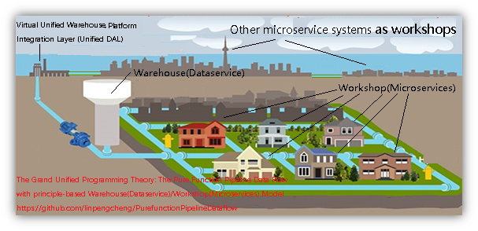

# 微软Singularity AI计算平台的架构来源于用我的仓库/车间模型改造的四年前Brainwave项目架构 

版权所有 © 2022-02-25 林鹏程， 保留所有权利。

微软四年前Brainwave项目提供支持的 Azure 机器学习硬件加速模型的预览
—— 一个向客户提供面向 AI 工作负载的 FPGA 处理平台。
从它的架构图上看，它是一个复杂的网络架构。

在论文2022-02-16(v1), 2022-02-21(v2), 
Dharma Shukla, and etc.(Microsoft), 
[Singularity: Planet-Scale, Preemptive and Elastic Scheduling of AI Workloads](https://arxiv.org/abs/2202.07848) 中，研究人员表示：

> Singularity的核心是一种新颖的、可以感知工作负载的调度程序，
> 可以透明地抢占和弹性扩展深度学习工作负载，
> 在不影响正确性和性能的情况下，
> 提高全球范围内的 AI 加速器（例如 GPU、FPGA）的利用率。

从它的架构图上看，它的架构与我的仓库/车间模型的变种
**`"调度中心（虚拟的全局统一仓库，集成层或平台，企业集团的母公司）"模式`**
高度一致，只增加了可抢占的、可迁移的和可动态调整的调度，
这不是一个高性能的方法，但却是对外提供云服务所必需的方法，
它可以防止不恰当的或长时间的计算任务占用资源，
导致其它服务长长时间的等待。
另外，它的层次比较多，
这也是大规模分布式云服务一种无奈的选择，
如果可以的话，层次尽量不要太多。

下面是Singularity架构和[我在2021-04-29画的一张最相似的架构图](./Computer_Hardware_Architecture.png)的比较。

- 我的架构图更简单和形象。它是标准仓库/车间模型的变种：
  **`"调度中心（虚拟的全局统一仓库，集成层或平台，企业集团的母公司）"模式`**
- Singularity架构表达了更多一些的实现细节。
  注意：它的上下层次关系是1:n的关系，
  因此它和我的架构图都是树形，
  它的表达方式容易让人误解它的架构形状。
- 备注: 红字是我增加的标注，方便读者比较。

## 参考文献

- 2018，林鹏程，[基于数学的大统一编程理论：纯函数管道数据流和基于原则的仓库/车间模型](https://github.com/linpengcheng/PurefunctionPipelineDataflow)
  - [模型的概述](../Readme_Chinese.md#模型的概述)
    - 仓库 ...
    - 它可以没有容器，...
  - [单一领导和统一调度](../Readme_Chinese.md#单一领导和统一调度)
  - [和计算机硬件体系的统一](../Readme_Chinese.md#和计算机硬件体系的统一)
  - [和信息系统集成模型的统一](../Readme_Chinese.md#和信息系统集成模型的统一)

- 2022-02-16(v1), 2022-02-21(v2), Dharma Shukla, and etc. (Microsoft), [Singularity: Planet-Scale, Preemptive and Elastic Scheduling of AI Workloads](https://arxiv.org/abs/2202.07848)

  这篇论文的作者包括 Azure 首席技术官 Mark Russinovich；
  合作伙伴架构师 Rimma Nehme，他曾在 Azure Cosmos DB 工作，
  直到 2019 年转到 Azure 从事人工智能和深度学习工作；
  以及技术研究员 Dharma Shukla等。

- 2022-02-23，新智元，[「奇点」AI计算平台细节曝光！竟是微软四年前老项目重生](https://www.51cto.com/article/702316.html)

