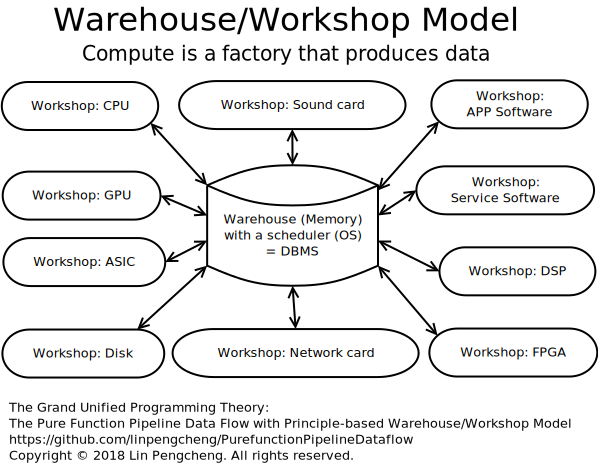

# Microsoft's AI computing platform Singularity's architecture adopts my Warehouse/Workshop Model

Copyright © 2022-02-25 Lin Pengcheng. All rights reserved.

[goto 2022-02-25 Chinese edition (中文版)](./Follower_MS_Singularity_Architecture.md)

In the paper 2022-02-16(v1), 2022-02-21(v2), 
Dharma Shukla, and etc.(Microsoft), 
[Singularity: Planet-Scale, Preemptive and Elastic Scheduling of AI Workloads](https://arxiv.org/abs/2202.07848) :

> At the heart of Singularity is a novel, 
> workload-aware scheduler that can transparently preempt 
> and elastically scale deep learning workloads 
> to drive high utilization without impacting 
> their correctness or performance across a global feet 
> of AI accelerators (e.g., GPUs, FPGAs). 

From its architecture diagram, 
its architecture is highly consistent with the 
**`"dispatch center (Virtual Unified Warehouse, 
integration layer or platform, the parent company 
of the enterprise group)" model`**, 
which only adds content about transparently preempt
and elastically scale, which is not a high-performance method, 
but it is necessary to provide cloud services externally, 
which prevents inappropriate or long computing tasks 
from taking up resources and causing other services 
to wait for long periods of time. 
In addition, it has more levels, 
which is also a helpless choice for large-scale 
distributed cloud services, if you can, 
try not to have too many levels.

2022-02-22, [Microsoft goes public with details on its 'Singularity' AI infrastructure service](https://www.zdnet.com/article/microsoft-goes-public-with-details-on-its-singularity-ai-infrastructure-service/)

> Microsoft officials previously have discussed plans 
> to make FPGAs, or field-programmable gate arrays, 
> available to customers as a service. In 2018, 
> Microsoft went public about its "Project Brainwave" 
> work which was designed to provide fast AI 
> processing in Azure." At that time, Microsoft made 
> available a preview of Azure Machine Learning 
> Hardware Accelerated Models powered by Brainwave 
> in the cloud -- a first step in making FPGA 
> processing for AI workloads available to customers. 

> I would guess that Singularity is the next phase 
> in turning Brainwave into a commercially available 
> service. I've asked Microsoft for a comment on that. 
> I've also asked when and how Microsoft plans to 
> turn Singularity into a commercially available service. 
> I will update this post with any information I get back.

From Brainwave's architecture diagram, 
it is a complex network architecture.
I think Microsoft refactored Brainwave 
with my `Warehouse/Workshop Model`, 
and named it Singularity.

Below is a comparison of the Singularity architecture 
and [my Warehouse/Workshop Model diagram I drew on 2021-04-29](./Computer_Hardware_Architecture.png).  

- My Warehouse/Workshop Model diagram is simpler and more figurative. 
  It is a variant of the standard Warehouse/Workshop Model:
  **`"dispatch center (Virtual Unified Warehouse, 
  integration layer or platform, 
  the parent company of the enterprise group)" model`**
  
- The Singularity architecture expresses 
  some more implementation details. 

  > Figure 1 shows the high-level architecture of Singularity, 
  > including its hierarchical scheduling system consisting 
  > of scheduling `micro-services` at the global, 
  > regional and workload scopes.

  Note: Its hierarchical relationship is a 1:n relationship, 
  so it and my Warehouse/Workshop Model diagram are tree-shaped, 
  and its expression is easy to misunderstand 
  its architectural shape.
  
- **Note: The red text is the annotation I added, 
  and the reader can see that it is highly consistent 
  with my Warehouse/Workshop Model diagram. 
  My annotation also fills in the missing 
  microservices architecture information, 
  more perfect.**

- **Important Note: They forgot to add citations 
  to my articles in the references.**

2022-02-16(v1), 2022-02-21(v2), Microsoft's AI computing platform Singularity's architecture

<table>
	<tr align="middle">
		<th>2018 MS Brainwave Architecture</th>
		<th>2022.02 MS Singularity Architecture</th>
	</tr>
	<tr>
		<td></td>
		<td></td>
	</tr>
</table>

Microsoft Singularity Architecture with my annotations.

2021-04-29, My Warehouse/Workshop Model diagram

1. Computer Hardware Network/Cloud Architecture

2. Architecture diagram of integration services 
   (dispatch center, virtual warehouse) and microservices
   ([2021-03-01 v1](./Microservice_Architecture.png), 
   2021-04-29 v1r1)

2021-06-20, v1, [Standard Warehouse/Workshop Model hardware architecture diagram](./Computer-Hardware-Star-WWM.svg)

2021-11-15, v2, Computer hardware and software integration architecture diagram

## Reference

- 2018-02-13, Lin Pengcheng, [The Math-based Grand Unified Programming Theory: The Pure Function Pipeline Data Flow with Principle-based Warehouse/Workshop Model](https://github.com/linpengcheng/PurefunctionPipelineDataflow)

  - [Overview of the model](../README.md#Overview-of-the-model)
    - Warehouse ...
      - It can have no container, at this time it is just a 
        dispatch center (Virtual Unified Warehouse, 
        integration layer or platform, the parent company 
        of the enterprise group).
        - ...
        - When the scale is too large to control, 
          This situation may only exist in the hardware system. 
          In the software system, this situation generally 
          does not happen, because it is just a bunch of 
          simple workshop functions surrounding a Warehouse (or DB), 
          which is very simple.
        - ...
  - [Single Leader and Unified Scheduling](../README.md#Single-Leader-and-Unified-Scheduling)
  
  - [The unification with Computer Hardware Architecture](../README.md#The-unification-with-Computer-Hardware-Architecture)
  
  - [The unification of Microservice and Intelligent-thread](../README.md#The-unification-of-Microservice-and-Intelligent-thread)
  
  - [The unification with Information System Integration Model](../README.md#The-unification-with-Information-System-Integration-Model)
  
  - [The unification with object-oriented](../README.md#The-unification-with-object-oriented)
    - [Traditional OO&FP architecture VS. Warehouse/Workshop Model](../README.md#Traditional-OO-and-FP-architecture-VS-Warehouse-Workshop-Model)
  
  - 2021.11.15, [The future OS kernel will be a data-oriented scheduler (with Computer hardware and software integration architecture diagram)](./OS_as_DB_en.md)
  
- 2022-02-16(v1), 2022-02-21(v2), arxiv.org, [Singularity: Planet-Scale, Preemptive and Elastic Scheduling of AI Workloads](https://arxiv.org/abs/2202.07848)
  
  Authors: Dharma Shukla, Muthian Sivathanu, Srinidhi Viswanatha, 
  Bhargav Gulavani, Rimma Nehme, Amey Agrawal, Chen Chen, 
  Nipun Kwatra, Ramachandran Ramjee, Pankaj Sharma, Atul Katiyar, 
  Vipul Modi, Vaibhav Sharma, Abhishek Singh, Shreshth Singhal, 
  Kaustubh Welankar, Lu Xun, Ravi Anupindi, Karthik Elangovan, 
  Hasibur Rahman, Zhou Lin, Rahul Seetharaman, Cheng Xu, 
  Eddie Ailijiang, Suresh Krishnappa, Mark Russinovich (Microsoft)
  
  Authors of this paper include:
  - Mark Russinovich, Chief Technology Officer of Azure;
  - Partner architect Rimma Nehme, who worked at Azure Cosmos DB, 
    Until 2019, he moved to Azure to work on AI and deep learning;
  - Technical researcher: Dharma Shukla et al. 
 
  **Important Note: They forgot to add citations 
  to my articles in the references.**
  
- 2022-02-22, [Microsoft goes public with details on its 'Singularity' AI infrastructure service](https://www.zdnet.com/article/microsoft-goes-public-with-details-on-its-singularity-ai-infrastructure-service/)
