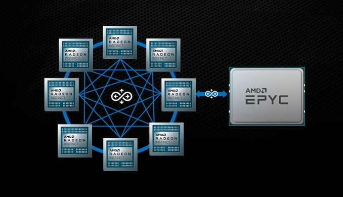
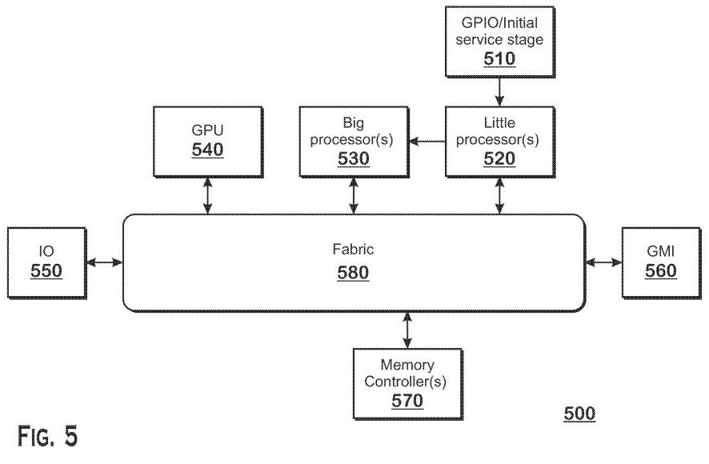

# Prediction: Intel will use "RISC-V plus x86 compatibility layer" or "RISC-V plus x86 heterogeneous computing architecture" to develop a new generation of "warehouse/workshop model" CPU

Copyright © 2021.06.14 Lin Pengcheng. All rights reserved.

Prediction: Intel will use RISC-V plus x86 compatibility layer to develop a new generation of "warehouse/workshop model" CPU. 
It will not only reverse the competitive situation with Apple M1, but also open up the market for IoT CPUs.

If developing the x86 compatibility layer is too troublesome, there is a quick solution, 
because my "warehouse/workshop model" naturally supports heterogeneous computing and can 
provide 1 or 2 x86 cores in the CPU to execute x86 instructions specifically to provide compatibility.

Intel has been in a lot of trouble recently. There is an Apple M1 chip using my warehouse/workshop model on the front, 
which not only greatly beats Intel’s CPU in performance, but also maintains a greater energy-saving advantage. 
In addition, as I said in the blog post, M1 also There is a lot of space for optimization. 
The new M2 is said to be coming out soon, and AMD is catching up. Intel is in a hurry to change its CEO.

Intel’s original technology accumulation and development route can be said to be useless. 
If it is useful, it has been put into the market long ago, and now it can only be completely updated..

Now the only architecture that fully surpasses the "von Neumann architecture" is my "warehouse/workshop model". 
I think Intel has no choice but to "warehouse/workshop model".

If ARM and RISC-V manufacturers join the "warehouse/workshop model" CPU competition, it will pose a serious threat to Intel. 
I have not seen any news in this regard, but at least one or two major manufacturers should join the competition,
The market has entered a stage of fierce competition. In addition, Microsoft's support is very important, 
especially Microsoft and Qualcomm have a close cooperative relationship to jointly develop the "Windows/ARM PC".

The huge x86 stock market will still give Intel a period of funding and buffer space, 
and the future Internet of Things market will be even broader. 
About news of "Intel Offers $2 Billion for RISC-V Chip Startup SiFive",
RISC-V is open source and can be extended proprietary. 
It is the best choice for Intel with excellent CPU design talents, 
and it is also the best choice for Intel to strive for market leadership. 

Danger and opportunity coexist. This is the moment that determines the life and death of Intel, 
just like the phoenix nirvana, or rebirth from ashes, or burned to death.

Intel CEO Pat Gelsinger's recent announcement that the company would begin licensing its own x86 processor designs 
to other firms as part of its new IDM 2.0 initiative was surprising. 
In view of Intel's previous licensing policy, I think this is Intel's preparation to abandon x86.
Intel’s x86 processor design license is likely to target Chinese companies.
I think x86 is an outdated design that is about to be phased out.
Chinese companies should not bid too high.

Reference: [Intel Offers $2 Billion for RISC-V Chip Startup SiFive: Bloomberg](https://www.tomshardware.com/news/intel-offers-dollar2-billion-for-risc-v-startup-sifive-bloomberg)

- 2021-06-14, I published it on Chinese Sina Weibo.
- 2021-06-15, I published it on github, twitter, reddit/programming.
- There is a good discussion in reddit r/programming. [Link](https://www.reddit.com/r/programming/comments/o0gxy3/prediction_intel_will_use_riscv_plus_x86/)

# 预测: Intel将用“RISC-V加x86兼容层”或“RISC-V加x86异构计算架构”开发新一代"仓库/车间模型"的CPU

版权所有 © 2021.06.14 林鹏程， 保留所有权利。

Intel应该是准备以RISC-V为核心，加x86兼容层，对标Apple M1开发新一代"仓库/车间模型"的CPU，同时还能开拓占领物联网CPU的市场。

如果开发x86兼容层太麻烦，有一个快速解决方案，因为我的“仓库/车间模型”对天然支持异构计算，可以在CPU内提供1~2个x86核心专门执行x86指令，提供兼容能力。

Intel最近麻烦挺大，前有Apple采用我的仓库/车间模型的M1芯片，不仅在性能大胜Intel的CPU,而且还保持更大的节能优势，
另外，我以前在博文上讲过，M1还有很大的优化空间，新的M2据说也快出来了，后有AMD赶超，可谓前有虎后有狼，Intel都急得临阵换帅（CEO）了。

Intel这个牙膏厂，它的原有的技术积累和开发路线可以说是不顶用了，如果有早就推出来了，当下只能大动作更新换代了，
现在唯一表现出全面超越"冯·诺依曼体系结构"的架构只有我的“仓库/车间模型”了，我想它除了“仓库/车间模型”之外，别无选择了。

最近有消息Intel 准备花 20 亿美元收购RISC-V的初创公司SiFive， 难道它准备以“RISC-V加x86兼容层”或“RISC-V加x86异构计算架构”，
对标M1开发新一代"仓库/车间模型"的CPU，同时还能开拓占领物联网CPU的市场。

如果ARM和RISC-V生产商加入“仓库/车间模型”CPU的竞争，将对Intel产生严重威胁，
目前我没有看到这方面的消息，但应该至少会有1~2家主要生产商加入竞争，市场进入激烈竞争阶段。
另外，微软的支持至关重要，特别是微软与高通有密切合作关系，联合开发了“Windows/ARM PC”。

巨大的x86存量市场仍然会给予Intel带来一段时间的资金来源和缓冲空间，未来的物联网市场更为广阔。RISC-V是开源的，
并且可以进行专有扩展，它是拥有优秀CPU设计人才的Intel的最好选择，也是Intel争取市场领导地位的最好选择。
危险与机遇并存，这是决定Intel生死存亡的时刻，如同凤凰涅槃，或浴火重生，或烧成死灰。

Intel CEO Pat Gelsinger最近宣布，该公司将开始向其他公司发放自己的x86处理器设计许可，作为其新的IDM 2.0计划的一部分。
鉴于Intel以前的许可政策，我认为这是Intel准备放弃x86. Intel发放的x86处理器设计许可的目标对象很可能是中国公司，
我认为x86是一种过时的即将被淘汰的设计，中国公司不应出价太高，避免成为冤大头。

参考：[Intel Offers $2 Billion for RISC-V Chip Startup SiFive: Bloomberg](https://www.tomshardware.com/news/intel-offers-dollar2-billion-for-risc-v-startup-sifive-bloomberg)

- 2021-06-14, 首发在新浪微博.
- 2021-06-15, 发布在 github, twitter, reddit/programming.
- 在reddit r/programming有一个很好的讨论。[链接](https://www.reddit.com/r/programming/comments/o0gxy3/prediction_intel_will_use_riscv_plus_x86/)

----

附文

x86+RISC-V异构计算架构是我的创新，2021年6月14日发表在微博，
我2021年6月15日在github的博客发表，隔几天发现这篇AMD专利申请文章了。
由`Joel Hruska`于2021年6月15日写的
[《AMD Is Working on Its Own Hybrid x86 CPU: Patent Filing》](https://www.extremetech.com/computing/323713-amd-is-working-on-its-own-hybrid-x86-cpu-patent-filing)
这篇文章的最早评论2021-06-16，这篇是根据以前的旧文章修改的，
以前的旧文章只是类似于ARM的`big.Little`核，专利的内容是在big核与Little核之间的任务转移方法。
该文仅在开头和结尾增加一小段`Hybrid x86 CPU`表述，非常突兀和不协调。

这篇文章提到了AMD的[“"METHOD OF TASK TRANSITION BETWEEN HETEROGENOUS PROCESSORS"”](https://www.freepatentsonline.com/y2021/0173715.html)
专利，它的内容是在big核与Little核之间的任务转移方法，
依据我的“仓库/车间模型”的10原则，AMD的这项专利技术是毫无必要的，
违反了任务分工原则、有序原则、明确原则。

从文章示意图上看，AMD以Infinity Fabric总线为中心，
实现CPU-CPU之间的任务转移，未来打算实现GPU-GPU，CPU-GPU之间的任务转移，
即车间之间的互联，我在制造工业内，还未见到过这种车间任意互联的架构。
这是个网状结构，非常混乱和复杂，扩展性差，灵活性差，数据利用效率差。
我认为它在同类处理器之间的任务转移相对容易，
在不同类处理器之间的任务转移是复杂和困难的，效果也不会太好。
我认为它远远不如我的仓库/车间模型简单、可靠、灵活、扩展性强，
以仓库（数据）为中心，数据存取效率高，大致类似我以前发的[微软数据工厂/管道架构和仓库/车间模型的比较](https://github.com/linpengcheng/PurefunctionPipelineDataflow/blob/master/doc/diff_WWModel_AzureDataFactoryPipe_cn.md)
实际上,尽管Apple M1尚未完全实现仓库/车间模型，但Apple M1的表现非常优秀。

