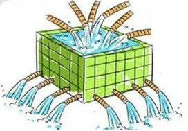

# 化腐朽为神奇

版权所有 © 2021.08.18- 林鹏程， 保留所有权利。

我觉得当下的技术文章或论文风气不大好,
都在往高大上, 往难里写, 遣词用句煞费苦心, 生怕别人一下子就看懂了,
显得自己没本事, 浅薄了, 所以把本事全用在这方面了, 以致于文章看起就象是在不说人话.

一个常识：解决一个数学问题时，解法越简单越牛逼。
其实，在其他学科和工作中也是如此，只是人们往往搞反了。

我的这篇文章很可能有点象毒鸡汤, 但是矫枉必需过正, 
我在这篇文章里就先示范性讲解我是怎么用简单、清楚、明白、通俗的技术和文字，
创造伟大的“大统一编程理论：纯函数管道数据流和基于原则的仓库/车间模型”理论。

"大统一编程理论：纯函数管道数据流和基于原则的仓库/车间模型"做为 IT领域划时代的理论成果, 
它"冯·诺依曼体系结构"， 统一了IT的软硬件理论, 并把它从手工作坊生产理论水平提高到现代制造业的大工业生产理论水平, 
苹果M1芯片虽然尚未完全实现了它的理论，就成了世界最快的芯片。

1.　小学级的数学原型, IT领域划时代的理论成果

它的数学原型就是小学数学的“水池进排水问题”，当我们在这个数学问题上增加水池和进出水管的数量、
不同种类液体的组合、进出水时间和速度等多种因素，就形成一个动态树形甘特图形态的仓库／车间模型。
它依然是一个小学生可以解决的数学问题.　它应该是数学原型最简单最形象的IT架构。

因此，从理论上讲，成为世界上最顶尖的科学家其实只要小学程度的教育就够了。

2. 来源业余编程人员所用的僵尸产品Foxpro的菜鸟级开发思想

很多IT软件开发人员看不起数据库信息系统开发的CRUD（新建，查，改，删）技术, 觉得这是低端菜鸟专属技术， 

其实这世上没有菜的技术, 只有菜的人.

"大统一编程理论：纯函数管道数据流和基于原则的仓库/车间模型"这门技术最善于使用菜鸟技能, 
它的方法就面向数据,  一根筋直线条地对数据进行CRUD操作，直至完成项目任务.
并且能轻易完成并行，并发，分布式，异构计算等复杂困难的软硬件任务。

"仓库/车间模型"源自制造工业的大工业生产,最适合大批大量高负载的大规模计算场景. 
虽然它应用在 Apple M1 时, M1 不仅成为世界上最快的芯片,而且保持极低的功耗. 
但实际上它的最佳应用场景是超级计算机或云计算, 
Apple M1 芯片的小身板不能发挥出它的优越性, 只是开席前的小菜一碟。

这一切的最早起源思想是来自业余编程人员使用最多的、曾经的桌面数据库王者、已经被遗忘淘汰的 Foxpro。

简单而广泛应用的傻瓜技术， 往往蕴含着神奇的力量！

3.

4.

5.

未完待续......

